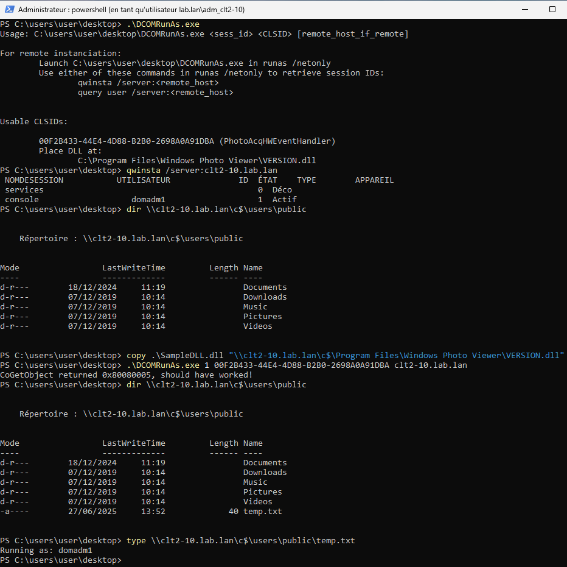

# DCOMRunAs

DCOMRunAs instantiates COM objects in the session of a logged-on user on a remote machine. By targeting a COM object subject to DLL hijacking and dropping a custom DLL at that path, the payload DLL will be loaded in the context of the logged-on remote user.

**Note:** This project is a proof-of-concept, and has not been extensively tested.

## Context & theory

Initially an internal PoC developped last year, it is released following the publication of [BitlockMove](https://github.com/rtecCyberSec/BitlockMove) by @S3cur3Th1sSh1t, his [TROOPERS 2025 slides](https://github.com/S3cur3Th1sSh1t/Creds/blob/master/Talks/Revisiting_Cross_Session_Activation_Troopers_2025.pdf) are a good overview of the general idea (looking forward to the recording and blogpost !).

Since the technique is now public, we decided to publish the tool as-is, even though it's not as thouroughly tested as we'd like, so obviously use at your own risk, and feel free to flag any issue in the repository tracker.

The original idea (on our side) came from playing with James Forshaw's [oleviewdotnet](https://github.com/tyranid/oleviewdotnet) and noticing the "Create In Session" button for objects running as `Interactive User`. The moniker code was taken and adapted to C from [here](https://github.com/tyranid/oleviewdotnet/blob/7e9aa884e013b6773ef578ad391dbad9b30c11da/OleViewDotNet/Utilities/COMUtilities.cs#L145) and the `CoGetObject` code from [there](https://github.com/tyranid/oleviewdotnet/blob/7e9aa884e013b6773ef578ad391dbad9b30c11da/OleViewDotNet/Utilities/COMUtilities.cs#L130).

Main differences with `BitlockMove`:

* `DCOMRunAs` is not battle-tested 🙂
* Works on both Windows Server and client systems
* Does not require registry modification (for COM hijacking purposes)
* Difference in OPSEC considerations (registry modification aside):
    * loading a "well-known" DLL (`version.dll` and such, specifically not a `KnownDLL`) from an unexpected path
    * cross-session activation with `CoGetObject` and a session moniker
* Common OPSEC considerations (for completeness)
    * remote instantiation of a specific CLSID
    * signed process loading an unexpected unsigned DLL

## Practice

Compile a hijacking DLL that will perform the actions wanted. Name it and forward exports accordingly. Then, from a `runas /netonly` shell as a local administrator of the target machine:

1. Drop it at the correct path on the target machine.

2. Grab the target session identifier. It can be done remotely by running one of these commands:

```
qwinsta /server:<remote_host>
query user /server:<remote_host>
```

3. Run the tool with the correct session ID and CLSID:

```
C:\> DCOMRunAs.exe <sess_id> <CLSID> [remote_host_if_remote]
```

## Usable CLSIDs

* `00F2B433-44E4-4D88-B2B0-2698A0A91DBA` (PhotoAcqHWEventHandler, executing `rundll32.exe`)
    * Place the DLL at one of these locations:
	    * `C:\Program Files\Windows Photo Viewer\OLEACC.dll`
	    * `C:\Program Files\Windows Photo Viewer\PROPSYS.dll`
	    * `C:\Program Files\Windows Photo Viewer\STI.dll`
	    * `C:\Program Files\Windows Photo Viewer\WINMM.dll`
	    * `C:\Program Files\Windows Photo Viewer\dwmapi.dll`
	    * `C:\Program Files\Windows Photo Viewer\UxTheme.dll`
	    * `C:\Program Files\Windows Photo Viewer\VERSION.dll`

## Example


